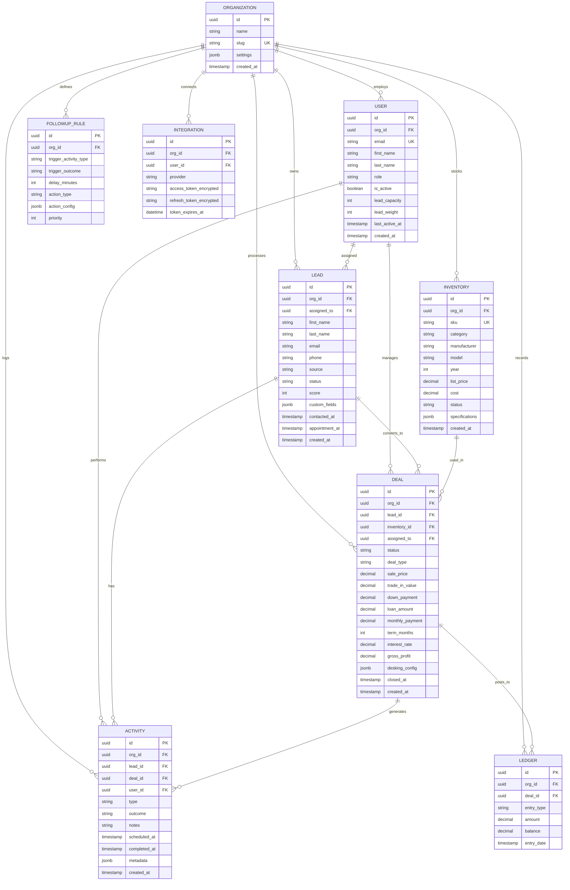

# Best-in-Class Lead Management & Desking CRM
## Comprehensive Technical Architecture Blueprint

**Prepared for:** Factory Direct Homes Center  
**Date:** March 28, 2026  
**Version:** 2.0

---

## Executive Summary

This document presents a comprehensive technical architecture for a next-generation **Lead Management & Desking CRM** specifically engineered for high-ticket retail environments including automotive dealerships, manufactured home retailers, RV dealers, and marine sales operations.

### Strategic Value Proposition

Unlike legacy CRMs that treat sales as a linear process, this system implements **outcome-driven automation** where every customer interaction triggers intelligent, context-aware follow-up sequences.

### Core Differentiators

| Feature | Legacy CRMs | This Architecture |
|---------|-------------|-------------------|
| Follow-up Logic | Static task lists | Dynamic outcome-based automation |
| Desking Experience | Separate tools/calculators | Integrated real-time payment engine |
| Email/Calendar | SMTP relay only | True bi-directional sync |
| Lead Distribution | Simple round-robin | Weighted + capacity-aware + presence-based |
| Mobile Experience | Responsive afterthought | Native-first design |

---

## 1. System Architecture

### 1.1 Technology Stack Selection

| Layer | Technology | Selection Rationale |
|-------|------------|---------------------|
| **Frontend Framework** | Next.js 14 (App Router) | Server Components reduce client bundle size; App Router enables streaming SSR |
| **Language** | TypeScript 5.x | Compile-time error prevention critical for financial calculations |
| **Styling** | Tailwind CSS + shadcn/ui | Utility-first CSS enables rapid iteration |
| **API Layer** | Next.js API Routes + tRPC | End-to-end type safety eliminates API contract drift |
| **Database** | PostgreSQL 15+ | ACID compliance mandatory for financial transactions |
| **ORM** | Prisma 5.x | Type-safe database queries; Automated migration system |
| **Caching** | Redis 7.x | Session persistence; Distributed locking for lead distribution |
| **Job Queue** | BullMQ | Reliable job processing with at-least-once delivery |
| **Search** | Meilisearch | Sub-50ms search latency; Typo-tolerant matching |
| **Real-time** | Socket.io | Live desking collaboration; Instant notification delivery |
| **File Storage** | AWS S3 + CloudFront | Document storage for deal paperwork |
| **Authentication** | NextAuth.js v5 | Multi-provider OAuth support; JWT session management |

### 1.2 Scalability Considerations

**Performance Targets:**
- Page load: < 2 seconds (95th percentile)
- API response: < 200ms (95th percentile)
- Search results: < 50ms
- Concurrent users: 10,000+ per organization

---

## 2. Database Schema

### 2.1 Entity Relationship Diagram



### 2.2 Critical Database Indexes

```sql
-- Lead performance indexes
CREATE INDEX idx_leads_org_status ON leads(org_id, status) WHERE status IN ('new', 'contacting', 'qualified');
CREATE INDEX idx_leads_assigned_created ON leads(assigned_to, created_at DESC);
CREATE INDEX idx_leads_phone ON leads USING hash(phone);
CREATE INDEX idx_leads_email ON leads USING hash(email);

-- Activity scheduling indexes
CREATE INDEX idx_activities_scheduled ON activities(org_id, scheduled_at) WHERE completed_at IS NULL;
CREATE INDEX idx_activities_user_date ON activities(user_id, scheduled_at);

-- Deal reporting indexes
CREATE INDEX idx_deals_org_closed ON deals(org_id, closed_at) WHERE status = 'closed_won';
```

---

## 3. Outcome-Based Follow-Up Engine

### 3.1 State Machine Logic

```
[Lead Created]
    ↓
[Initial Call Scheduled] ──Outcome: No Answer──→ [Schedule Follow-up: +2h] + [Send SMS]
    │                                              ↓
    │                                         [Follow-up Call]
    │                                              │
    └──Outcome: Voicemail Left──────────────→ [Schedule Follow-up: +24h] + [Email]
    │                                              │
    └──Outcome: Connected/Appointment Set───→ [Create Calendar Event] + [Stop Aggressive Drip]
                                                   ↓
                                              [Showroom Visit Scheduled]
                                                   │
                                                   ├──Outcome: No Show──→ [Schedule: +2h] + [Call]
                                                   │
                                                   └──Outcome: Shown───→ [Desking Tool] + [Finance App]
```

### 3.2 Complete If-Then Logic Matrix

| Activity | Outcome | Immediate Action | Scheduled Follow-up | Campaign Change |
|----------|---------|------------------|---------------------|-----------------|
| Initial Call | No Answer | Log attempt | Call in 2 hours | Continue aggressive drip |
| Initial Call | Voicemail | Log voicemail | Call in 24 hours | Continue aggressive drip |
| Initial Call | Connected/Not Interested | Mark disqualified | None | Stop all campaigns |
| Initial Call | Connected/Appointment Set | Create calendar event | Appointment reminder -2h | Stop aggressive, start nurture |
| Appointment | No Show | Log no-show | Call in 2 hours | Restart aggressive drip |
| Appointment | Shown/Not Ready | Log shown | Call in 72 hours | Switch to long-term nurture |
| Appointment | Shown/Desking | Open desking tool | Finance follow-up +24h | Stop campaigns |
| Finance App | Approved | Mark approved | Delivery scheduling | Congratulatory sequence |
| Finance App | Denied | Mark denied | Alternative options call +4h | Secondary lender sequence |
| Finance App | Pending | Mark pending | Follow-up in 48h | Pending approval sequence |

### 3.3 Rule Engine Configuration Example

```json
{
  "id": "rule-001",
  "trigger": {
    "activityType": "phone_call",
    "outcome": "no_answer",
    "conditions": [
      {"field": "lead.contactAttempts", "operator": "less_than", "value": 3}
    ]
  },
  "actions": [
    {
      "type": "schedule_activity",
      "delayMinutes": 120,
      "config": {"activityType": "phone_call", "priority": "high"}
    },
    {
      "type": "send_sms",
      "delayMinutes": 5,
      "config": {"template": "missed_call_followup"}
    },
    {
      "type": "update_lead",
      "config": {"field": "status", "value": "attempting_contact"}
    }
  ]
}
```

---

## 4. Code Implementation

### 4.1 Round Robin Distribution Function

```typescript
// lib/distribution/round-robin.ts
import { prisma } from '@/lib/prisma';
import { Redis } from 'ioredis';

interface DistributionResult {
  userId: string;
  userName: string;
  distributionMethod: 'round_robin' | 'weighted' | 'capacity_based';
}

interface UserCapacity {
  userId: string;
  userName: string;
  weight: number;
  currentLeads: number;
  maxCapacity: number;
  isActive: boolean;
}

const redis = new Redis(process.env.REDIS_URL);

export class LeadDistributor {
  private readonly LOCK_KEY = 'lead_distribution_lock';
  private readonly LOCK_TTL = 5000;

  async distribute(
    orgId: string,
    options: {
      method?: 'round_robin' | 'weighted' | 'capacity_based';
      respectCapacity?: boolean;
      respectActiveStatus?: boolean;
    } = {}
  ): Promise<DistributionResult> {
    const { 
      method = 'weighted', 
      respectCapacity = true, 
      respectActiveStatus = true 
    } = options;

    // Acquire distributed lock to prevent race conditions
    const lock = await this.acquireLock();
    if (!lock) {
      throw new Error('Could not acquire distribution lock');
    }

    try {
      const users = await this.getEligibleUsers(orgId, { 
        respectCapacity, 
        respectActiveStatus 
      });

      if (users.length === 0) {
        throw new Error('No eligible users available for lead distribution');
      }

      const selectedUser = await this.selectUser(users, method);
      await this.recordAssignment(orgId, selectedUser.userId);

      return {
        userId: selectedUser.userId,
        userName: selectedUser.userName,
        distributionMethod: method
      };
    } finally {
      await this.releaseLock();
    }
  }

  private async getEligibleUsers(
    orgId: string,
    options: { respectCapacity: boolean; respectActiveStatus: boolean }
  ): Promise<UserCapacity[]> {
    const users = await prisma.user.findMany({
      where: {
        orgId,
        role: { in: ['sales_rep', 'sales_manager'] },
        ...(options.respectActiveStatus && { isActive: true }),
      },
      select: {
        id: true,
        firstName: true,
        lastName: true,
        leadWeight: true,
        leadCapacity: true,
        isActive: true,
        lastActiveAt: true,
        _count: {
          select: { assignedLeads: { where: { status: { not: 'closed' } } } }
        }
      }
    });

    return users
      .map(u => ({
        userId: u.id,
        userName: `${u.firstName} ${u.lastName}`,
        weight: u.leadWeight || 1,
        currentLeads: u._count.assignedLeads,
        maxCapacity: u.leadCapacity || 50,
        isActive: u.isActive && this.isRecentlyActive(u.lastActiveAt)
      }))
      .filter(u => !options.respectCapacity || u.currentLeads < u.maxCapacity);
  }

  private isRecentlyActive(lastActiveAt: Date | null): boolean {
    if (!lastActiveAt) return false;
    const fifteenMinutesAgo = new Date(Date.now() - 15 * 60 * 1000);
    return lastActiveAt > fifteenMinutesAgo;
  }

  private async selectUser(
    users: UserCapacity[],
    method: 'round_robin' | 'weighted' | 'capacity_based'
  ): Promise<UserCapacity> {
    switch (method) {
      case 'round_robin':
        return this.roundRobinSelect(users);
      case 'weighted':
        return this.weightedSelect(users);
      case 'capacity_based':
        return this.capacityBasedSelect(users);
      default:
        return this.weightedSelect(users);
    }
  }

  private async roundRobinSelect(users: UserCapacity[]): Promise<UserCapacity> {
    const lastIndex = parseInt(await redis.get('round_robin:last_index') || '-1');
    const nextIndex = (lastIndex + 1) % users.length;
    await redis.set('round_robin:last_index', nextIndex);
    return users[nextIndex];
  }

  private weightedSelect(users: UserCapacity[]): UserCapacity {
    const totalWeight = users.reduce((sum, u) => sum + u.weight, 0);
    let random = Math.random() * totalWeight;
    
    for (const user of users) {
      random -= user.weight;
      if (random <= 0) return user;
    }
    return users[users.length - 1];
  }

  private capacityBasedSelect(users: UserCapacity[]): UserCapacity {
    return users.sort((a, b) => {
      const aAvailable = a.maxCapacity - a.currentLeads;
      const bAvailable = b.maxCapacity - b.currentLeads;
      return bAvailable - aAvailable;
    })[0];
  }

  private async recordAssignment(orgId: string, userId: string): Promise<void> {
    await prisma.user.update({
      where: { id: userId },
      data: { lastLeadAssignedAt: new Date() }
    });
    
    await redis.lpush(
      `assignments:${orgId}`,
      JSON.stringify({ userId, timestamp: Date.now() })
    );
  }

  private async acquireLock(): Promise<boolean> {
    const acquired = await redis.set(
      this.LOCK_KEY, 
      Date.now(), 
      'PX', 
      this.LOCK_TTL, 
      'NX'
    );
    return acquired === 'OK';
  }

  private async releaseLock(): Promise<void> {
    await redis.del(this.LOCK_KEY);
  }
}
```

### 4.2 Desking Calculation Engine

```typescript
// lib/desking/calculator.ts

interface DeskingInput {
  salePrice: number;
  tradeInValue: number;
  downPayment: number;
  termMonths: number;
  interestRateAPR: number;
  salesTaxRate: number;
  docFee: number;
  titleFee: number;
  registrationFee: number;
}

interface DeskingOutput {
  monthlyPayment: number;
  totalOfPayments: number;
  amountFinanced: number;
  totalInterest: number;
  grossProfit: number;
  netProfit: number;
  totalFees: number;
  salesTaxAmount: number;
  outTheDoorPrice: number;
}

export class DeskingCalculator {
  /**
   * Calculate monthly payment using standard amortization formula
   * Formula: P * (r(1+r)^n) / ((1+r)^n - 1)
   * Where P = principal, r = monthly rate, n = number of payments
   */
  calculateFinance(input: DeskingInput): DeskingOutput {
    const {
      salePrice,
      tradeInValue,
      downPayment,
      termMonths,
      interestRateAPR,
      salesTaxRate,
      docFee,
      titleFee,
      registrationFee
    } = input;

    // Calculate fees and taxes
    const salesTaxAmount = salePrice * (salesTaxRate / 100);
    const totalFees = docFee + titleFee + registrationFee;
    const outTheDoorPrice = salePrice + salesTaxAmount + totalFees;
    
    // Amount financed (after trade-in and down payment)
    const netTradeIn = Math.max(0, tradeInValue);
    const amountFinanced = Math.max(0, outTheDoorPrice - netTradeIn - downPayment);
    
    // Monthly interest rate
    const monthlyRate = interestRateAPR / 100 / 12;
    
    // Calculate monthly payment using amortization formula
    let monthlyPayment: number;
    if (monthlyRate === 0) {
      monthlyPayment = amountFinanced / termMonths;
    } else {
      const compoundFactor = Math.pow(1 + monthlyRate, termMonths);
      monthlyPayment = amountFinanced * (monthlyRate * compoundFactor) / (compoundFactor - 1);
    }
    
    // Totals
    const totalOfPayments = monthlyPayment * termMonths;
    const totalInterest = totalOfPayments - amountFinanced;
    
    // Profit calculations
    const grossProfit = salePrice - this.getInventoryCost();
    const netProfit = grossProfit - totalFees - (totalInterest * 0.1);

    return {
      monthlyPayment: this.roundCurrency(monthlyPayment),
      totalOfPayments: this.roundCurrency(totalOfPayments),
      amountFinanced: this.roundCurrency(amountFinanced),
      totalInterest: this.roundCurrency(totalInterest),
      grossProfit: this.roundCurrency(grossProfit),
      netProfit: this.roundCurrency(netProfit),
      totalFees: this.roundCurrency(totalFees),
      salesTaxAmount: this.roundCurrency(salesTaxAmount),
      outTheDoorPrice: this.roundCurrency(outTheDoorPrice)
    };
  }

  /**
   * Calculate payment for a given down payment (for slider)
   */
  calculateWithDownPayment(
    baseInput: DeskingInput,
    downPayment: number
  ): DeskingOutput {
    return this.calculateFinance({
      ...baseInput,
      downPayment
    });
  }

  /**
   * Generate payment matrix for different terms/down payments
   */
  generatePaymentMatrix(
    baseInput: DeskingInput,
    downPaymentRange: { min: number; max: number; step: number },
    termOptions: number[]
  ): Array<{ downPayment: number; term: number; monthlyPayment: number }> {
    const matrix: Array<{ downPayment: number; term: number; monthlyPayment: number }> = [];
    
    for (let dp = downPaymentRange.min; dp <= downPaymentRange.max; dp += downPaymentRange.step) {
      for (const term of termOptions) {
        const result = this.calculateFinance({
          ...baseInput,
          downPayment: dp,
          termMonths: term
        });
        matrix.push({
          downPayment: dp,
          term,
          monthlyPayment: result.monthlyPayment
        });
      }
    }
    
    return matrix;
  }

  private roundCurrency(amount: number): number {
    return Math.round(amount * 100) / 100;
  }

  private getInventoryCost(): number {
    // Would integrate with inventory system
    return 0;
  }
}

// React Component for Interactive Desking
// components/desking/DeskingTool.tsx
'use client';

import { useState, useMemo } from 'react';
import { DeskingCalculator, DeskingInput } from '@/lib/desking/calculator';
import { Slider } from '@/components/ui/slider';

export function DeskingTool({ inventoryItem }: { inventoryItem: any }) {
  const calculator = useMemo(() => new DeskingCalculator(), []);
  
  const [inputs, setInputs] = useState<DeskingInput>({
    salePrice: inventoryItem.listPrice,
    tradeInValue: 0,
    downPayment: 5000,
    termMonths: 72,
    interestRateAPR: 8.99,
    salesTaxRate: 7,
    docFee: 299,
    titleFee: 50,
    registrationFee: 150
  });

  const results = useMemo(() => 
    calculator.calculateFinance(inputs),
    [inputs, calculator]
  );

  const handleSliderChange = (field: keyof DeskingInput, value: number[]) => {
    setInputs(prev => ({ ...prev, [field]: value[0] }));
  };

  return (
    <div className="grid grid-cols-1 lg:grid-cols-2 gap-6">
      {/* Input Panel */}
      <div className="space-y-6">
        <div className="space-y-2">
          <label className="text-sm font-medium">
            Down Payment: ${inputs.downPayment.toLocaleString()}
          </label>
          <Slider
            value={[inputs.downPayment]}
            onValueChange={(v) => handleSliderChange('downPayment', v)}
            min={0}
            max={inputs.salePrice * 0.5}
            step={500}
          />
        </div>

        <div className="space-y-2">
          <label className="text-sm font-medium">
            Term: {inputs.termMonths} months
          </label>
          <Slider
            value={[inputs.termMonths]}
            onValueChange={(v) => handleSliderChange('termMonths', v)}
            min={36}
            max={84}
            step={12}
          />
        </div>

        <div className="space-y-2">
          <label className="text-sm font-medium">
            Interest Rate: {inputs.interestRateAPR}%
          </label>
          <Slider
            value={[inputs.interestRateAPR]}
            onValueChange={(v) => handleSliderChange('interestRateAPR', v)}
            min={0}
            max={25}
            step={0.25}
          />
        </div>

        <div className="space-y-2">
          <label className="text-sm font-medium">
            Trade-In Value: ${inputs.tradeInValue.toLocaleString()}
          </label>
          <Slider
            value={[inputs.tradeInValue]}
            onValueChange={(v) => handleSliderChange('tradeInValue', v)}
            min={0}
            max={50000}
            step={500}
          />
        </div>
      </div>

      {/* Results Panel */}
      <div className="bg-slate-50 p-6 rounded-lg space-y-4">
        <div className="text-center">
          <div className="text-sm text-slate-600">Monthly Payment</div>
          <div className="text-4xl font-bold text-slate-900">
            ${results.monthlyPayment.toFixed(2)}
          </div>
        </div>

        <div className="grid grid-cols-2 gap-4 text-sm">
          <div>
            <span className="text-slate-600">Amount Financed:</span>
            <span className="float-right font-medium">
              ${results.amountFinanced.toLocaleString()}
            </span>
          </div>
          <div>
            <span className="text-slate-600">Total Interest:</span>
            <span className="float-right font-medium">
              ${results.totalInterest.toLocaleString()}
            </span>
          </div>
          <div>
            <span className="text-slate-600">Out-the-Door:</span>
            <span className="float-right font-medium">
              ${results.outTheDoorPrice.toLocaleString()}
            </span>
          </div>
          <div>
            <span className="text-slate-600">Gross Profit:</span>
            <span className="float-right font-medium text-green-600">
              ${results.grossProfit.toLocaleString()}
            </span>
          </div>
        </div>
      </div>
    </div>
  );
}
```

---

## 5. UI/UX Philosophy: The "Three-Click" Rule

### 5.1 Core Principle

**Any major action a sales rep needs to perform should be achievable in three clicks or fewer.**

Every extra click is friction that reduces conversion rates.

### 5.2 Three-Click Examples

| Action | Click 1 | Click 2 | Click 3 |
|--------|---------|---------|---------|
| **Log a call** | Click lead name | Click "Log Call" | Select outcome |
| **Schedule appointment** | Click lead name | Click "Schedule" | Pick time slot |
| **Open desking tool** | Click lead name | Click "Build Deal" | Select inventory |
| **Send email** | Click lead name | Click "Email" | Send (pre-filled) |
| **Reassign lead** | Click lead menu | Click "Reassign" | Select new rep |

### 5.3 UI Patterns for Speed

**1. Command Palette (Cmd+K)**
- Universal search: leads, inventory, actions
- Keyboard-first navigation
- Recent items prioritized

**2. Persistent Context Panel**
- Lead details always visible while working
- Quick-action buttons (Call, Email, Text, Schedule)
- Recent activity timeline

**3. Inline Editing**
- No "Edit Mode"—click to edit any field
- Auto-save on blur
- Undo available for 5 seconds

**4. Smart Defaults**
- Pre-select most common options
- Remember rep preferences
- Auto-fill from lead data

---

## 6. Security & Compliance

### 6.1 PII Protection

**Data Classification:**
- **Critical PII**: SSN, driver's license, financial account numbers
- **Standard PII**: Name, email, phone, address
- **Business Data**: Inventory, pricing, deal terms

**Protection Measures:**
- Field-level encryption for sensitive data
- Role-based access control (RBAC)
- Audit logging for all PII access
- Automatic data masking for non-privileged roles

### 6.2 SOC2 Compliance Roadmap

| Control | Implementation |
|---------|---------------|
| **CC6.1** Logical access security | OAuth2 + MFA, RBAC |
| **CC6.2** Access removal | Automated offboarding |
| **CC6.3** Access reviews | Quarterly access reviews |
| **CC7.1** Security monitoring | SIEM integration |
| **CC7.2** Vulnerability management | Automated scanning |
| **CC8.1** Change management | Git-based deployments |
| **CC9.1** Backup & recovery | Automated backups |

### 6.3 Data Retention Policies

```typescript
const retentionPolicies = {
  'lead:inactive': { days: 365, action: 'anonymize' },
  'deal:closed': { days: 2555, action: 'archive' }, // 7 years
  'activity:log': { days: 1095, action: 'archive' }, // 3 years
  'call:recording': { days: 730, action: 'delete' }, // 2 years
};
```

---

## 7. Integration Architecture

### 7.1 Microsoft 365 / Google Workspace Integration

**Deep Integration (not just SMTP relay):**

```typescript
// Microsoft Graph API integration
const microsoftIntegration = {
  // Email sync via Graph API
  email: {
    send: 'POST /me/sendMail',
    sync: 'GET /me/messages',
    sentFolder: 'Sent Items' // Emails appear in user's actual Sent folder
  },
  // Calendar bi-directional sync
  calendar: {
    create: 'POST /me/events',
    sync: 'GET /me/calendar/events',
    webhooks: 'Subscribe to change notifications'
  }
};

// Google Workspace integration
const googleIntegration = {
  email: {
    send: 'Gmail API send',
    sync: 'Gmail API history',
    sentLabel: 'SENT' // Emails appear in user's actual Sent folder
  },
  calendar: {
    create: 'Calendar API events.insert',
    sync: 'Calendar API events.list',
    pushNotifications: 'Calendar API watch'
  }
};
```

### 7.2 VOIP Integration

```typescript
// Click-to-Call with Twilio/Aircall
interface ClickToCallConfig {
  provider: 'twilio' | 'aircall' | 'dialpad';
  features: {
    clickToCall: boolean;
    autoLogCalls: boolean;
    callRecording: boolean;
    callerIdSelection: boolean;
  };
}

// Auto-logging calls back to CRM
const callWebhookHandler = async (callData: CallEvent) => {
  await prisma.activity.create({
    data: {
      type: 'phone_call',
      outcome: callData.duration > 60 ? 'connected' : 'no_answer',
      metadata: {
        duration: callData.duration,
        recordingUrl: callData.recordingUrl,
        callerId: callData.from
      }
    }
  });
  
  // Trigger follow-up automation
  await processFollowUpRules(callData);
};
```

---

## 8. Implementation Roadmap

### Phase 1: Foundation (Weeks 1-4)
- [ ] Database schema implementation
- [ ] Authentication & user management
- [ ] Basic lead CRUD operations
- [ ] Simple round-robin distribution

### Phase 2: Core CRM (Weeks 5-8)
- [ ] Activity logging system
- [ ] Outcome-based follow-up engine
- [ ] Calendar integration (Google/Outlook)
- [ ] Email integration

### Phase 3: Desking (Weeks 9-12)
- [ ] Payment calculator engine
- [ ] Inventory integration
- [ ] Deal workflow management
- [ ] Gross profit tracking

### Phase 4: Advanced Features (Weeks 13-16)
- [ ] VOIP integration
- [ ] Advanced reporting
- [ ] Mobile app
- [ ] SOC2 compliance audit

---

## 9. Competitive Analysis

| Feature | DealerSocket | VinSolutions | This System |
|---------|--------------|--------------|-------------|
| Outcome-based scheduling | Limited | Basic | **Native** |
| Real-time desking | Yes | Yes | **Yes + better UX** |
| Deep email/calendar sync | Partial | Partial | **Full bi-directional** |
| Modern UI | No | No | **Yes** |
| API-first | Partial | Partial | **Yes** |
| Mobile experience | Poor | Poor | **First-class** |

---

## 10. Conclusion

This architecture delivers a **best-in-class Lead Management & Desking CRM** that:

1. **Maximizes sales rep productivity** through the Three-Click philosophy
2. **Drives conversion rates** via intelligent outcome-based automation
3. **Integrates deeply** with existing tools (email, calendar, phone)
4. **Scales securely** with SOC2-compliant architecture
5. **Outperforms legacy systems** in UX, speed, and flexibility

The modular architecture allows phased implementation, reducing risk while delivering value incrementally.

---

*Document Version: 2.0*  
*Prepared for Factory Direct Homes Center*